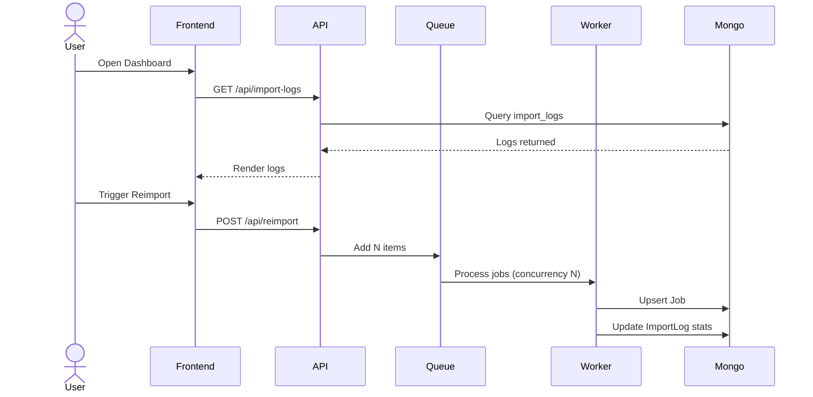
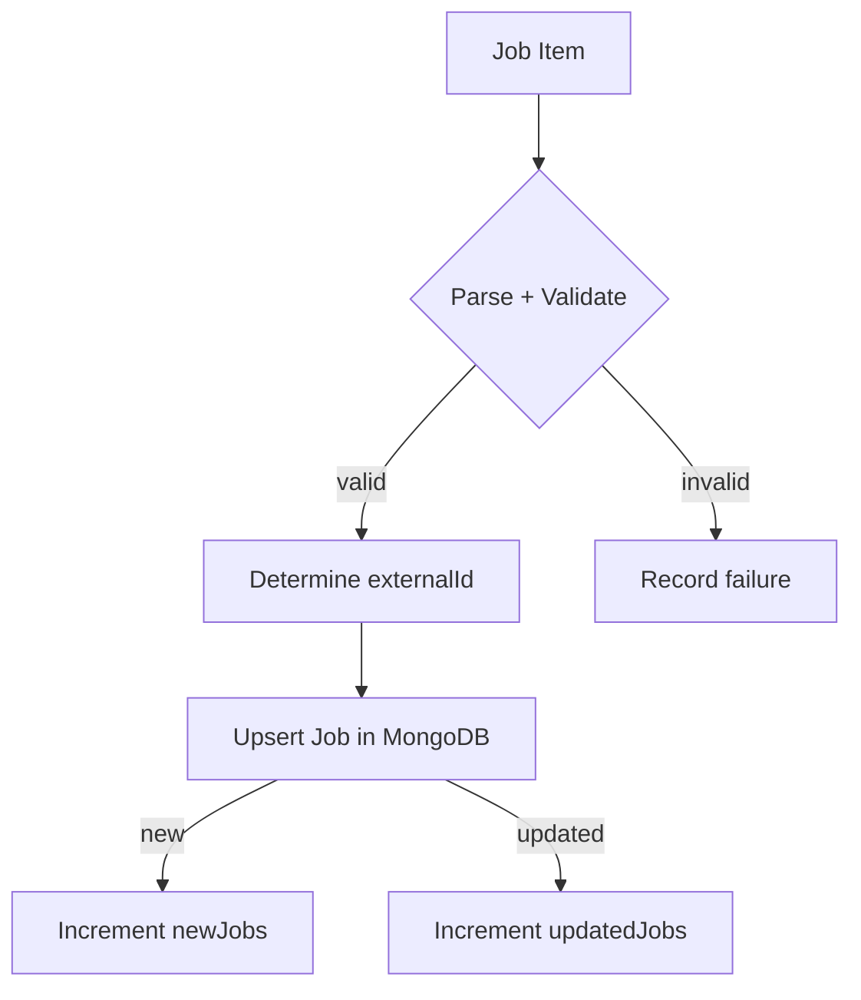

# System Architecture

A modular architecture designed for reliability, scalability, and clean separation between:

- **Frontend (Next.js)**
- **Backend API (Express)**
- **Background Worker (Bull Queue)**
- **MongoDB**
- **Redis Queue**

## 1️⃣ High-Level Architecture Diagram

```mermaid
flowchart LR
    A[Job Feeds (XML/JSON)] -->|fetcher| B(Express API Server)
    B -->|enqueue items| C(Redis Queue)
    C --> D(Worker Process)
    D -->|upsert| E[(MongoDB)]
    D -->|update stats| F[(Import Logs)]
    B --> G[Next.js Admin Client]
    G -->|view logs| F
    G -->|view jobs| E
    G -->|trigger reimport| B
```

## 2️⃣ Backend Flow



## 3️⃣ Queue Processing Flow



## 4️⃣ MongoDB Schema Design

### Job Schema

```json
{
  "title": "...",
  "company": "...",
  "location": "...",
  "externalId": "unique-field",
  "sourceFeed": "jobicy.com",
  "raw": {},
  "createdAt": "...",
  "updatedAt": "..."
}
```

### Import Log Schema

```json
{
  "timestamp": "...",
  "fileName": "feed-url",
  "totalFetched": 0,
  "newJobs": 0,
  "updatedJobs": 0,
  "failedJobs": 0,
  "failures": []
}
```

